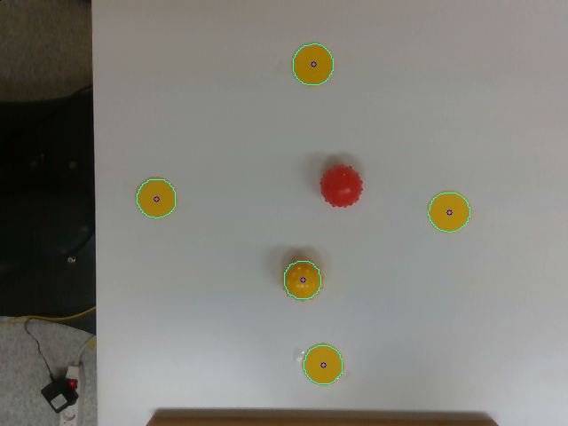

# Ballbot - Robot nhặt bóng

Giới thiệu: **Sawyer robot nhặt các quả bóng trên mặt bàn**

Thiết bị: Sawyer robot, Realsense Camera D435i, table, color balls 

Ý tưởng: Dùng xử lý ảnh để phát hiện vị trí của vật trong ảnh. Sau đó chuyển vị trí theo điểm ảnh sang vị trị trong không gian cartesian của robot và dùng ik service cho phần control.

Video demo: [Youtube](https://www.youtube.com/watch?v=42_p_2_yxcc)

# Chạy chương trình

Sử dụng câu lệnh sau:

```
roslaunch ballbot ballbot.launch
```

## Xác định vị trí của các vật thể trong ảnh

Chúng ta sẽ sử dụng **OpenCV** để xác vật thể dựa trên màu sắc. 

Code example:

```
rosrun ballbot detector.py
```

Giải thích code:

Đọc bức ảnh vào và chuyển nó về kênh màu HSV vì kênh màu này ít bị ảnh hưởng bởi ánh sáng.

```python
image = cv2.imread(img1.png)
hsv = cv2.cvtColor(image, cv2.COLOR_BGR2HSV)
```

Sau đó, xác định mặt nạ dựa trên khoảng màu sắc. Trong ví dụ này, ta sẽ xác định các vật thể có màu vàng.

```python
lower = np.array([15, 180, 120])
upper = np.array([30, 255, 255])
mask = cv2.inRange(hsv, lower, upper)
```

Các mặt nạ thu được đã tương đối chính xác. Tuy nhiên, để chắc chắn ta cần xử lý thêm một bước loại bỏ các đốm màu nhiểu nhỏ.

```python
KERNELOPEN = np.ones((5, 5))
KERNELCLOSE = np.ones((5, 5))

mask_open = cv2.morphologyEx(mask, cv2.MORPH_OPEN, KERNELOPEN)
mask_close = cv2.morphologyEx(mask_open, cv2.MORPH_CLOSE, KERNELCLOSE)
```

Mặt nạ chỉ gồm các điểm có giá trị bằng 0 và 1.

Tiếp theo, chúng ta sẽ xác định đường viên bao:

```python
conts, h = cv2.findContours(mask_close.copy(), cv2.RETR_EXTERNAL, cv2.CHAIN_APPROX_NONE)
```

và xác định tâm 

```python
centers = [getCenter(*cv2.boundingRect(c)) for c in conts]
```

Hàm _boundingRect_ sẽ trả về tọa độ góc trên bên trái, chiều dài và chiều rộng (x, y, w, h). Tâm dễ dàng được xác định như sau:

```python
def getCenter(x, y, w, h):
    return int(x + 0.5 * w), int(y + 0.5 * h)
```

Hiển thị lên cho trực quan:

```python
cv2.drawContours(image, conts, -1, (255, 255, 0), 1)
    for center in centers:
        cv2.circle(image, center, 3, [255, 0, 0])
    cv2.imshow('mage', image)
    cv2.waitKey(0)
```

Hàm _waitKey(0)_ sẽ đóng của sổ hiển thị khi một ký tự được nhấn. Lưu ý, cần click và cửa sổ hiển thị sau đó mới nhấn phím.

Kết quả minh họa:




## Calibration

Ý tưởng: chúng ta có 4 tấm marker màu vàng. Bước 1, chúng ta sẽ xác định vị trí của các marker theo đơn vị pixel. Bước 2, di chuyển cánh tay robot tới vị trí các tấm màu từ đó ta xác định tọa độ trong không gian cartesian. Từ đó tính được mỗi pixel ứng với bao nhiêu đơn vị trong không gian cartesian.

Code example

```
rosrun ballbot calibration.py
```

Thông tin sẽ được lưu vào folder 'ballbot/calib'.

Độ cao của bàn được thiết lập tại mức **80 cm**.

## Tạo ROS Package 

Bước 1: 

```bash
cd ~/ros_ws/src
catkin_create_pkg ballbot std_msgs rospy roscpp
cd ~/ros_ws
catkin_make
```

_ballbot_ = ball + robot: tên package

_std_msgs_, _rospy_, _roscpp_: các thư viện phụ thuộc

Bước 2: Chỉnh sửa các meta-data <version>, <maintainer>, <author>, <license>, <url>

```xml
<?xml version="1.0"?>
<package format="2">
    <name>ballbot</name>
    <version>1.0.0</version>
    <description>The ballbot package</description>
    
    <maintainer email="trunghieu@kaist.ac.kr">Trung Hieu</maintainer>
    <license>BSD</license>
    <url type="website">http://hieubkset.github.io</url>
    <author email="trunghieu@kaist.ac.kr">Trung Hieu</author>

    <buildtool_depend>catkin</buildtool_depend>
    <build_depend>roscpp</build_depend>
    <build_depend>rospy</build_depend>
    <build_depend>std_msgs</build_depend>

    <build_export_depend>roscpp</build_export_depend>
    <build_export_depend>rospy</build_export_depend>
    <build_export_depend>std_msgs</build_export_depend>

    <exec_depend>roscpp</exec_depend>
    <exec_depend>rospy</exec_depend>
    <exec_depend>std_msgs</exec_depend>
</package>

```

# Tạo một Publisher

Mục đích: tạo một publisher xử lý ảnh và trả về vị trí của quả bóng

### Tạo một msg

```
cd ~/ros_ws/src/ballbot
mkdir msg
cd msg
subl Centroid.msg
```

Nội dung file Centroid.msg

```
int32 x
int32 y
```

Trong package.xml, bỏ chú tính hai phần sau:

```
<build_depend>message_generation</build_depend>
<exec_depend>message_runtime</exec_depend>
```

Trong CMakeLists.txt, thêm _message_generation_ vào find_package

```
find_package(catkin REQUIRED COMPONENTS
  roscpp
  rospy
  std_msgs
  message_generation
)
```

Thêm _message_runtime_ vào catkin_package

```
catkin_package(
   CATKIN_DEPENDS message_runtime ...
)
```

Khai báo tạo ```Centroid.msg`` trong thư mục msg 

```
add_message_files(
  FILES
  Centroid.msg
)
```

Bỏ chú thích phần

```
generate_messages(
  DEPENDENCIES
  std_msgs
)
```

Sau đó, build lại source code

```
cd ~/ros_ws
catkin_make
```

Để kiểm tra việc tạo msg

```
rosmsg show Centroid
```

### Publisher Pseudocode

```python
#!/usr/bin/env python
import rospy
from ballbot.msg import Centroid

def main():
	pub = rospy.Publisher('ball_position', Centroid, queue_size=10)
    rospy.init_node('ball_publisher', anonymous=True)
    rate = rospy.Rate(10)
    
    while not rospy.is_shutdown():
    	pub.publish(Centroid(-1, -1))
        rate.sleep()
```

Lưu ý: luôn bắt đầu file bằng ```#!/usr/bin/env python``` nếu không khi chạy ```rosrun``` sẽ gặp hiện giống như bị lag.

 ```rate = rospy.Rate(10)``` and ```rate.sleep()``` để đảm bảo thông tin sẽ được gửi đi 10 lần trong 1s. Nội dung trong vòng lặp vì vậy cần chạy dưới 100 ms. Phần còn dư sẽ được bù bởi hàm ```rate.sleep```.

Để chạy câu lệnh

```
rosrun ballbot ballpub.py
```

Ta cần chuyển file về dạng thực thi

```
cd ~/ros_ws/src/ballbot/src
chmod +x ballpub.py
```

Không nên đặt tên file .py trong ```src``` cùng với tên package, khi đó import msg sẽ bị báo lỗi không tìm thấy package.

# Tạo một Service

## Tạo một srv

```
cd ~/ros_ws/src/ballbot
mkdir srv
cd srv
subl Centroid.srv
```

Nội dung file ```Centroid.srv```

```
bool data
---
int32 x
int32 y
```

Trong CMakeLists.txt, 

```
add_service_files(
  FILES
  Centroid.srv
)
```

Các bước tiếp theo giống như phần tạo msg.

